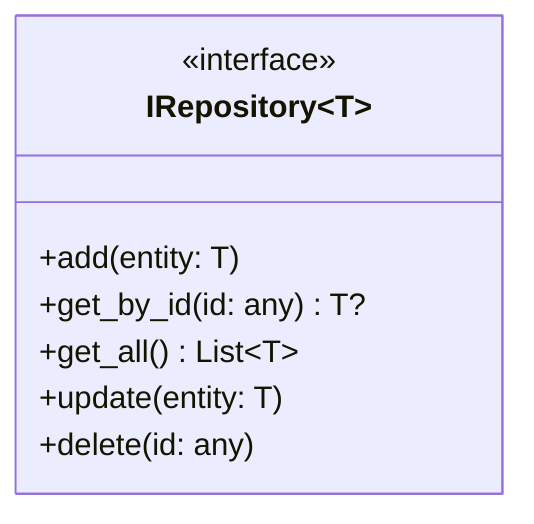
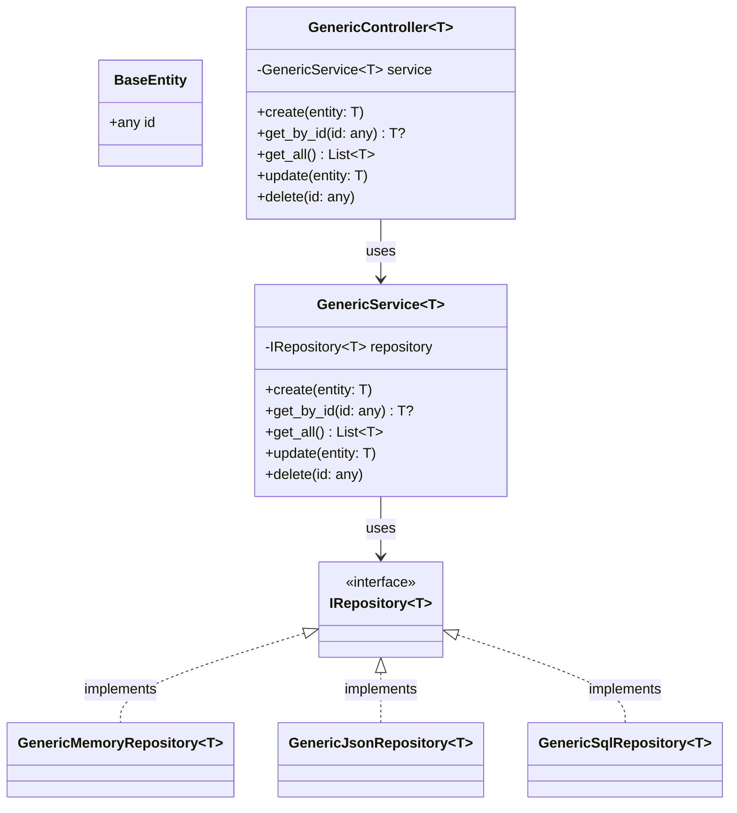
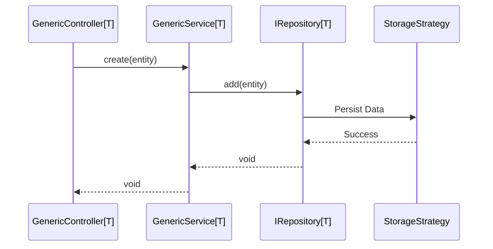

# Software Design Description (SDD) - libbase

## 1. Solution Architecture

### 1.1 Architectural Pattern
`libbase` follows a **Strict Layered Architecture** designed to provide a reusable foundation for enterprise applications. It decouples domain logic from persistence mechanisms using the **Generic Repository Pattern**.

| Layer | Component | Responsibility |
|-------|-----------|----------------|
| **Presentation** | **Controllers** | Acts as a Facade/Entry Point. Coordinates requests and delegates to services. |
| **Business Logic** | **Services** | Orchestrates business logic and repository interactions. |
| **Data Access** | **Repositories** | Abstracts storage via `IRepository[T]`. Implemented using strategies. |
| **Persistence** | **Strategies** | Concrete storage: `SQLAlchemy`, `JSON File`, or `In-Memory`. |
| **Domain** | **Base Entities** | Core definitions like `BaseEntity` used as the foundation for domain models. |

### 1.2 Design Patterns
- **Strategy Pattern**: Enables switching between different storage backends (SQL, JSON, Memory) without changing business logic.
- **Generic Repository**: Provides a standardized CRUD interface (`add`, `get_by_id`, `get_all`, `update`, `delete`) for any entity.
- **Facade Pattern**: Controllers provide a simplified public interface to the underlying complex service and repository layers.
- **Dependency Injection**: Services and Controllers receive their dependencies (repositories/services) via initialization, promoting testability.

## 2. Component Design

### 2.1 Generic Repository Interface
The `IRepository[T]` interface defines the contract for all persistence operations.

### 2.2 Storage Strategies
`libbase` provides three primary implementations of the repository interface:
1.  **GenericMemoryRepository**: Stores entities in a local dictionary. Ideal for unit tests.
2.  **GenericJsonRepository**: Serializes entities to a JSON file. Useful for lightweight data storage.
3.  **GenericSqlRepository**: Uses SQLAlchemy for relational database persistence.

## 3. Class Hierarchy

## 4. Execution Flow (CRUD)

